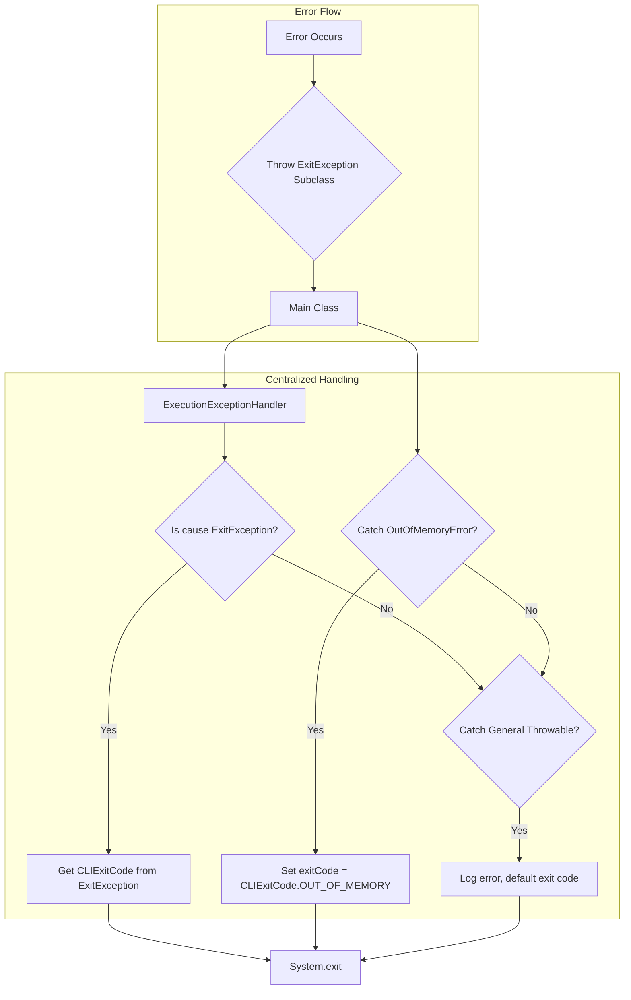
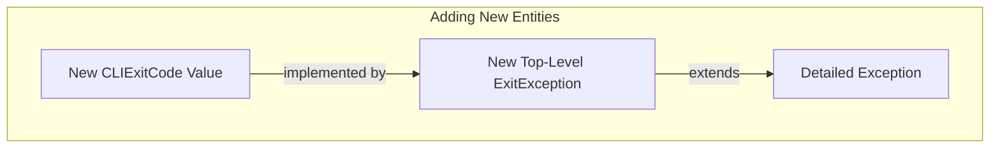

- Feature Name: error_handling_methodology
- Document Date: 2025-07-08
- Last Updated: 2025-07-08

# Summary

This document formalizes the existing custom error handling methodology within the project, which is built upon a hierarchy of `ExitException` classes and the use of `CLIExitCode` for structured program exits. This approach ensures consistent error reporting and allows for specific exit codes based on the type of error encountered, crucial for reliable automation and debugging.

# Motivation & Rationale

The motivation for this error handling methodology is rooted in the need for robust and predictable error reporting within the CLI tool. This includes ensuring standardized exit codes for seamless integration into automation pipelines, providing clear and actionable feedback to end-users, and controlling the display of stack traces based on error type, which facilitates bug reporting for unexpected issues. The exception hierarchy is designed to support fine-grained error differentiation to meet these requirements.

This design addresses the following aspects:
*   **Standardized Exit Codes for Automation:** The implementation of standardized exit codes aims to improve the integration of the CLI tool within automation pipelines. The use of `CLIExitCode` with `ExitException` establishes a mechanism for command-line tool errors to result in defined and machine-readable exit codes, supporting automated processing and decision-making. For instance, an exit code can indicate a read error (`CLIExitCode.READ_ERROR`), a validation error (`CLIExitCode.VALIDATION_ERROR`), or a command-line argument error (`CLIExitCode.USAGE`).
*   **User-Centric Error Reporting:** The system provides user-friendly error messages that include a clear call to action for end users. Stack traces are suppressed for most errors, being displayed only for unidentified bugs, where the expected user action is to submit a bug report. The `ExitException` hierarchy facilitates fine-grained exception reporting, which supports this requirement.
*   **Consistent Exception Usage:** Guidelines for extending `ExitException` and defining custom error types provide a framework for uniformity. For example, the addition of a new validation rule involves the use or extension of `ValidationException` with a relevant `ValidationRule` and message.
*   **Enhanced Maintainability and Readability:** A defined error handling strategy contributes to the comprehensibility and debugging of the codebase. Error propagation and handling follow established patterns. In the event of an unexpected program termination, the `ExitException` hierarchy and `CLIExitCode` system provide information for root cause analysis.

# Usage Guidelines

## Adding New `ExitException` Subclasses

When a new error scenario requires a specific program exit code and does not fit into existing `ExitException` subclasses, a new subclass should be created. Follow these guidelines:

1.  **When to Add New `CLIExitCode` Values:** New `CLIExitCode` values should only be added when a truly distinct category of error emerges that cannot be logically grouped under existing codes. When adding a new code, consider the numerical spacing in the `CLIExitCode` enum (e.g., `READ_ERROR(10), WRITE_ERROR(11), NON_EXISTENT_FILE(12)`). This spacing allows for future expansion within a logical category (e.g., `13`, `14` for other IO errors). DO NOT RENUMBER EXISTING CODES, this would be a breaking change for automation pipelines.
2.  **Single `CLIExitCode` Implementation:** For each distinct `CLIExitCode`, only one direct `ExitException` subclass should implement the `exitCode()` method to return that specific `CLIExitCode`.
3.  **Inheritance for Related Exceptions:** If multiple exception classes logically correspond to the same `CLIExitCode`, they should extend the `ExitException` subclass that already implements that `CLIExitCode`. This ensures consistent exit behavior and reduces boilerplate.
4.  **Extend `ExitException`:** The new exception class must extend `uk.ac.ebi.embl.converter.exception.ExitException` or one of its existing subclasses.
5.  **Implement or Inherit `exitCode()`:** If the new exception is the *primary* class for a `CLIExitCode`, it must override the `exitCode()` method to return the chosen `CLIExitCode`. If it extends an existing `ExitException` subclass that already defines the appropriate `CLIExitCode`, there is no need to override `exitCode()`.

**Example: Extending `ValidationException` for a specific validation failure**

If a new validation rule, `InvalidFeatureIdRule`, requires a distinct exception that still falls under the `VALIDATION_ERROR` category, it can extend `ValidationException` and inherit its `CLIExitCode.VALIDATION_ERROR`.

```java
public class InvalidFeatureIdException extends ValidationException {
    public InvalidFeatureIdException(String message) {
        super(message);
    }
    // No need to override exitCode() if it inherits CLIExitCode.VALIDATION_ERROR
}
```

**Example: Creating a new top-level `ExitException` for a new `CLIExitCode`**

If a new error type, for example, related to configuration issues, needs a new `CLIExitCode` (e.g., `CLIExitCode.CONFIGURATION_ERROR`), a new top-level `ExitException` subclass would be created to implement this specific exit code:

```java
public class ConfigurationException extends ExitException {
    public ConfigurationException(String message) {
        super(message);
    }

    @Override
    public CLIExitCode exitCode() {
        return CLIExitCode.CONFIGURATION_ERROR; // Assumes CONFIGURATION_ERROR is defined in CLIExitCode
    }
}
```


# System Overview / High-Level Design

The error handling strategy centers around the `ExitException` abstract class, which extends `java.lang.Exception`. Any error intended to cause a program exit with a specific status code must be a subclass of `ExitException`.

**Key Concepts:**

*   **`ExitException`:** The base class for all application-specific exceptions that should trigger a program exit with a defined status code.
*   **`CLIExitCode`:** An enum defining standardized integer exit codes for different error types (e.g., `READ_ERROR`, `WRITE_ERROR`, `VALIDATION_ERROR`, `USAGE`, `SUCCESS`, `OUT_OF_MEMORY`). Each `ExitException` subclass must implement the `exitCode()` method to return the appropriate `CLIExitCode`.

**Flow of Error Handling:**
1.  **Define Custom Exceptions:** For new error scenarios requiring a specific exit code, a new class extending `ExitException` is created.
    ```java
    public class MyCustomErrorException extends ExitException {
        public MyCustomErrorException(String message) {
            super(message);
        }

        @Override
        public CLIExitCode exitCode() {
            return CLIExitCode.GENERAL; // Using GENERAL for a generic custom error
        }
    }
    ```
2.  **Throw Exceptions:** When an error occurs, the appropriate `ExitException` subclass is thrown.
    ```java
    if (invalidCondition) {
        throw new CLIException("Invalid command line argument provided.");
    }
    ```
3.  **Centralized Handling (in `Main` class):** The `Main` class's `main` method utilizes a `CommandLine.ExecutionExceptionHandler` to catch `ExitException` instances. This handler extracts the `CLIExitCode` for the program's exit status. 
    ```java
    public static void main(String[] args) {
        int exitCode = 1; // Default error code
        try {
            exitCode = new CommandLine(new Main())
                    .setExecutionExceptionHandler(new ExecutionExceptionHandler())
                    .execute(args);
        } catch (OutOfMemoryError e) {
            // Specific handling for out of memory
            exitCode = CLIExitCode.OUT_OF_MEMORY.asInt();
        } catch (Throwable e) {
            // General catch-all for unexpected errors
            LOG.error(e.getMessage(), e);
        }
        System.exit(exitCode);
    }
    ```

**Flow diagram**


### ExitException Hierarchy and New Entity Addition



This system ensures a clear separation of error types, immediate insight into program exit behavior via exception types, and centralized control over `System.exit()` calls.

# Detailed Design & Implementation

The core components are `uk.ac.ebi.embl.converter.exception.ExitException` and `uk.ac.ebi.embl.converter.cli.CLIExitCode`.

**`uk.ac.ebi.embl.converter.exception.ExitException`:**
*   An abstract class extending `java.lang.Exception`.
*   Abstract method: `public abstract CLIExitCode exitCode();`: Must be implemented by subclasses to provide the specific exit code.

**`uk.ac.ebi.embl.converter.cli.CLIExitCode`:**
*   An enum defining integer exit codes.
*   Each enum constant represents a specific exit status (e.g., `GENERAL(1)`, `USAGE(2)`, `UNSUPPORTED_FORMAT_CONVERSION(3)`, `READ_ERROR(10)`, `WRITE_ERROR(11)`, `NON_EXISTENT_FILE(12)`, `VALIDATION_ERROR(20)`, `OUT_OF_MEMORY(30)`).
*   Provides `asInt()` method to retrieve the integer value.

**Example Implementations:**

*   **`uk.ac.ebi.embl.converter.exception.ValidationException`:**
    ```java
    public class ValidationException extends ExitException {
        // ... constructors and methods
        @Override
        public CLIExitCode exitCode() {
            return CLIExitCode.VALIDATION_ERROR;
        }
    }
    ```
    Used for data validation failures, potentially including details like line number and validation rule.


*   **`uk.ac.ebi.embl.converter.exception.InvalidGFF3HeaderException`:**
    ```java
    public class InvalidGFF3HeaderException extends ValidationException {
        public InvalidGFF3HeaderException(String message) {
            super(message);
        }
    }
    ```
    Used for invalid GFF3 header errors.

**Interaction with `picocli`:**
The `Main` class integrates with `picocli` via `CommandLine.setExecutionExceptionHandler`. The custom `ExecutionExceptionHandler` determines if the caught exception's cause is an `ExitException`. If so, it uses the `exitCode()` method to provide the appropriate integer for `System.exit()`, ensuring that all `ExitException` subclasses contribute correctly to the program's exit status.

# Alternatives Considered

1.  **Using `System.exit()` directly at every error point:**
    *   **Characteristics:** This approach involves direct calls to `System.exit()` at various error points within the codebase.
    *   **Implications:** This can result in dispersed program exit points, variations in exit codes, and increased complexity in tracing program exits and performing necessary cleanup operations prior to exit. Testing of error conditions may also present challenges.
2.  **Relying solely on standard Java exceptions (e.g., `IOException`, `IllegalArgumentException`) and catching them in `Main`:**
    *   **Characteristics:** This approach uses standard Java exceptions for error propagation, with a central catch block in the `Main` method.
    *   **Implications:** Standard exceptions do not inherently convey semantic meaning related to command-line tool exit codes. The mapping of each standard exception to a specific exit code within the `Main` method can be extensive and less explicit. This approach may also result in less specific error messages for the user.
3.  **Using a single generic `ToolException` with an `exitCode` field:**
    *   **Characteristics:** This approach involves a single, generic exception class that includes an `exitCode` field.
    *   **Implications:** This can lead to a less differentiated type system. Subclassing `ExitException` provides for more specific `catch` blocks and compile-time checks. The use of distinct type names, such as `ReadException`, can also provide more immediate information regarding the nature of the error.

# Technical Debt / Future Considerations
*   **Missing Test Coverage:** Implement comprehensive unit and integration tests for `ExitException` subclasses to verify `CLIExitCode` and constructor behavior, as well as the `Main` class's exception handling, as outlined in the Testing Strategy section.
*   **Expansion of `CLIExitCode`:** Assess if additional standard `CLIExitCode` values are required to cover future error scenarios.
*   **Error Reporting Framework:** Extend error handling to include more sophisticated error reporting, such as logging errors to a file, sending reports to a centralized service.

# Testing Strategy

The current testing strategy for this error handling system includes:
*   **Unit Tests:** Existing unit tests primarily focus on command-line argument parsing and validation rules within `MainTest.java`. Dedicated unit tests for each `ExitException` subclass to verify the correctness of their `exitCode()` method and constructors are currently not comprehensively implemented.
*   **Integration Tests:** Integration tests aim to verify that throwing an `ExitException` correctly results in the program exiting with the expected `CLIExitCode` when executed via the `Main` class. These tests should cover scenarios for `CLIException`, `ReadException`, `ValidationException`, `OutOfMemoryError`, and general `Throwable` catches. Comprehensive tests directly asserting `System.exit()` behavior for all `ExitException` types are not yet fully in place.
*   **End-to-End Tests:** Command-line tool tests should validate that specific erroneous inputs or conditions lead to the expected exit code, simulating real-world usage.

# Deployment & Operations

*   **Deployment:** The error handling mechanism is an integral part of the application's core logic and is deployed with the application itself. No special deployment steps are required beyond standard application deployment.

# Related Documentation & Resources

*   `uk.ac.ebi.embl.converter.exception.ExitException`
*   `uk.ac.ebi.embl.converter.cli.CLIExitCode`
*   `uk.ac.ebi.embl.converter.exception.CLIException`
*   `uk.ac.ebi.embl.converter.exception.ReadException`
*   `uk.ac.ebi.embl.converter.exception.ValidationException`
*   `picocli` documentation: [https://picocli.info/](https://picocli.info/)

