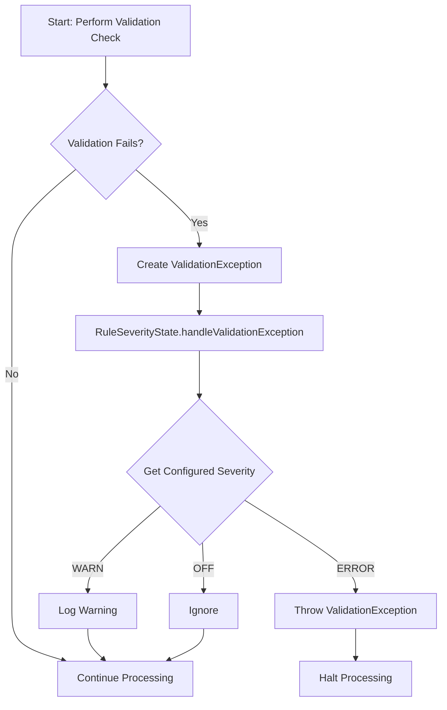

- Feature Name: Validation Rules
- Document Date: 2025-07-30
- Last Updated: 2025-07-30

# Summary

This document describes the validation rules framework, a system designed to enforce data integrity and consistency across various data inputs within the GFF3Tools project. It provides a flexible and extensible mechanism for defining, applying, and reporting on validation rules, ensuring that data conforms to predefined standards and business logic.

# Motivation & Rationale

The primary motivation for this framework is to ensure the quality and correctness of GFF3 data processed by the tools. Inconsistent or malformed data can lead to errors in downstream analysis, incorrect interpretations, and unreliable results. This framework addresses the need for a standardized and automated way to validate GFF3 files against a set of predefined rules.

Specific use cases include:
- **Input Data Validation:** Ensuring that GFF3 files provided as input to any of the GFF3Tools conform to the GFF3 specification and any additional project-specific constraints.
- **Data Transformation Validation:** Validating data after transformations (e.g., conversion from other formats) to ensure data integrity is maintained.
- **User-Selected Rules:** Allowing users to cherry-pick the validation rules based on their specific requirements.

The rationale behind the chosen design emphasizes extensibility, maintainability, and performance. A rules-based approach allows for easy addition of new validation checks without modifying core logic. The design prioritizes clear separation of concerns, making it easier to understand, debug, and enhance the framework.


# System Overview / High-Level Design

The validation rules framework is designed around a clear separation of concerns, with distinct components responsible for defining rules, managing their severity, and handling validation outcomes.

**Main Components:**
- **ValidationRule (uk.ac.ebi.embl.converter.validation.ValidationRule):** This enum serves as the central registry for all predefined validation rules. Each enum constant represents a specific validation check and includes a human-readable description.
- **RuleSeverity (uk.ac.ebi.embl.converter.validation.RuleSeverity):** This enum defines the possible severity levels for a validation rule: `OFF`, `WARN`, and `ERROR`. These severities dictate how a rule violation should be treated.
- **RuleSeverityState (uk.ac.ebi.embl.converter.validation.RuleSeverityState):** This singleton class acts as the configuration and runtime state manager for rule severities. It loads default severities from a properties file (`default-rule-severities.properties`) at initialization and provides methods to retrieve the severity for a given rule. It also supports overriding these defaults via command-line interface (CLI) options, allowing flexible runtime configuration. Crucially, it includes `handleValidationException()`, which centralizes the logic for responding to rule violations based on their configured severity. 
- **ValidationException (uk.ac.ebi.embl.converter.exception.ValidationException):** A custom exception class used to signal a validation rule violation. It encapsulates the `ValidationRule` that was violated.

**Diagram: Validation Failure Handling Sequence**

The following diagram illustrates the sequence of events when a validation rule is triggered:



**High-Level Interaction:**
1.  **Rule Definition:** Developers define new validation rules by adding entries to the `ValidationRule` enum.
2.  **Severity Configuration:** Default severities for these rules are set in `default-rule-severities.properties`.
3.  **Rule Execution:** During data processing (e.g., GFF3 parsing, feature conversion), specific validation logic is executed.
4.  **Violation Reporting:** If a validation check fails, a `ValidationException` is created, encapsulating the `ValidationRule` that was violated.
5.  **Exception Handling:** The `ValidationException` is then passed to `RuleSeverityState.handleValidationException()`. This method consults the current `RuleSeverityState` to determine the appropriate action:
    *   If the rule's severity is `OFF`, the exception is ignored.
    *   If the rule's severity is `WARN`, a warning message is logged.
    *   If the rule's severity is `ERROR`, the `ValidationException` is re-thrown, halting further processing.
    *   **Default Behavior:** If a validation rule is not explicitly configured in the properties file or via CLI, its severity defaults to `ERROR`. This ensures that new or unconfigured rules are treated as critical failures by default.

**Integration with Existing System:**
The framework integrates by allowing various data processing components (e.g., GFF3 readers, converters) to generate `ValidationException` when data integrity issues are detected. The centralized `RuleSeverityState.handleValidationException()` then ensures consistent error reporting and handling across the application.


# Usage Guidelines

The validation rules framework is primarily used internally by the GFF3Tools to ensure data quality. However, its configuration can be customized.

**Configuration:**
- **Default Severities:** The default severity for each validation rule is defined in `src/main/resources/default-rule-severities.properties`. This file maps `ValidationRule` enum names to `RuleSeverity` enum names.
- **Overriding Severities:** Users can override default rule severities using the `--rules` command-line option. This option accepts a comma-separated list of `key:value` pairs, where `key` is the `ValidationRule` enum name and `value` is the `RuleSeverity` enum name (e.g., `--rules FLATFILE_NO_SOURCE:WARN,GFF3_INVALID_RECORD:OFF`). Programmatic overriding is also possible via the `RuleSeverityState.putAll()` method.

 **Extending the Framework:**
- **Adding New Validation Rules:** To add a new validation rule, define a new enum constant in `uk.ac.ebi.embl.converter.validation.ValidationRule` with a descriptive message. Add the default severity for your new `ValidationRule` to `default-rule-severities.properties`
- **Extend ValidationException:** For greater control, extend the existing `ValidationException` to define your custom error when the validation fails.
- **Perform the validation**: Evaluate when an error occurs, and instantiate your exception. Then use `RuleSeverityState.handleValidationException()` to handle it. This method checks the configured severity for the given rule and either logs a warning or re-throws the exception as an error.

### Code Example

```java
// Example: How to use the Validation Rules Framework

import uk.ac.ebi.embl.converter.exception.ValidationException;
import uk.ac.ebi.embl.converter.validation.ValidationRule;
import uk.ac.ebi.embl.converter.validation.RuleSeverityState;
import uk.ac.ebi.embl.converter.validation.RuleSeverity; // For demonstrating configuration

public class ExampleValidationUsage {

    public static void main(String[] args) {
        // Step 1: Initialize RuleSeverityState (typically done once at application startup)
        // This loads default severities from default-rule-severities.properties
        // and can be overridden by CLI arguments.
        RuleSeverityState ruleSeverityState = RuleSeverityState.getInstance();

        // Optional: Override a rule severity programmatically for demonstration
        // For instance, setting GFF3_MISSING_ID to WARN
        ruleSeverityState.putAll(java.util.Collections.singletonMap(ValidationRule.GFF3_MISSING_ID, RuleSeverity.WARN));
        System.out.println("Configured GFF3_MISSING_ID severity: " + ruleSeverityState.getSeverity(ValidationRule.GFF3_MISSING_ID));

        // Step 2: Simulate a validation check failing
        // Let's assume we are processing a GFF3 record and find a missing ID
        boolean isIdMissing = true; // Our validation logic determines this

        if (isIdMissing) {
            // Step 3: Create a ValidationException for the failed rule
            ValidationException exception = new ValidationException(ValidationRule.GFF3_MISSING_ID);

            // Step 4: Pass the exception to RuleSeverityState.handleValidationException()
            // This method will either log a warning, throw an error, or ignore based on configuration.
            try {
                System.out.println("\nAttempting to handle ValidationException for GFF3_MISSING_ID...");
                ruleSeverityState.handleValidationException(exception);
                System.out.println("Validation for GFF3_MISSING_ID was handled (e.g., logged as WARN or OFF).");
            } catch (ValidationException e) {
                // If the rule's severity is ERROR, handleValidationException will re-throw it.
                // In this example this catch will would not execute because the rule severity is WARN.
                System.err.println("Validation for GFF3_MISSING_ID resulted in an ERROR: " + e.getMessage());
            }

            // Demonstrate a rule that defaults to ERROR (if not configured or explicitly set to ERROR)
            // For example, imagine a new rule `GFF3_DUPLICATE_FEATURE`
            // If it's not in default-rule-severities.properties and not overridden, it defaults to ERROR.
            ValidationException errorException = new ValidationException(ValidationRule.GFF3_DUPLICATE_FEATURE);
            System.out.println("\nAttempting to handle ValidationException for GFF3_DUPLICATE_FEATURE (defaults to ERROR)...");
            try {
                ruleSeverityState.handleValidationException(errorException);
                System.out.println("This message should not be printed if GFF3_DUPLICATE_FEATURE is ERROR.");
            } catch (ValidationException e) {
                System.err.println("Successfully caught expected ERROR for GFF3_DUPLICATE_FEATURE: " + e.getMessage());
            }
        }
    }
}
```
 
 
 # Detailed Design & Implementation

The core of the validation framework is implemented through a set of enums and a singleton class.

**Key Classes and Their Roles:**

1.  **`ValidationRule.java` (Enum):**
    *   **Purpose:** Defines a comprehensive list of all possible validation rules within the GFF3Tools. Each rule is a distinct type of data integrity check.
    *   **Implementation Details:** Each enum constant holds a `String` description that provides a human-readable explanation of the rule.

2.  **`RuleSeverity.java` (Enum):**
    *   **Purpose:** Establishes the severity levels for validation rule violations. This allows for flexible handling of issues, from ignoring minor warnings to halting execution for critical errors.
    *   **Implementation Details:** Each enum constant has an integer severity value, allowing for severities to be compared numerically.

3.  **`RuleSeverityState.java` (Singleton Class):**
    *   **Purpose:** This is the central component for managing and applying rule severities. It ensures that all parts of the application use a consistent set of rule configurations.
    *   **Implementation Details:**
        *   **Singleton Pattern:** Implemented as a singleton to guarantee a single, globally accessible instance. This prevents inconsistencies in rule severity configurations.
        *   **Properties Loading:** Upon initialization, it loads default rule severities from `src/main/resources/default-rule-severities.properties`. This allows for external configuration and easy modification of default behavior without code changes.
        *   **`handleValidationException(ValidationException exception)`:** This crucial method centralizes the error handling logic. It takes a `ValidationException`, checks its associated `ValidationRule`'s severity, and then performs the appropriate action.
    
4.  **`ValidationException.java` (Custom Exception):**
    *   **Purpose:** A specialized `RuntimeException` used to indicate that a validation rule has been violated. It carries information about the specific `ValidationRule` that failed.
    *   **Implementation Details:** Extends `RuntimeException` and includes a `ValidationRule` field to identify the failed rule.

**Corner Cases and Error Handling:**
- **Invalid Property Values:** If the properties file contains invalid `ValidationRule` or `RuleSeverity` names, `IllegalArgumentException` will be thrown by `valueOf()`, which is currently wrapped in a `RuntimeException` during `RuleSeverityState` initialization. This prevents the application from starting with malformed configurations.


# Alternatives Considered

**Annotation-Based Validation (e.g., similar to Bean Validation):**
    *   **Description:** This approach would involve defining validation rules as annotations that could be applied directly to data model fields or methods. A validation engine would then process these annotations at runtime.
    *   **Drawbacks:** While powerful for validating POJOs, this pattern is less suitable for stream-based or record-by-record processing common in GFF3 parsing and conversion, where validation often depends on the context of multiple records or the overall file structure rather than just individual field constraints. Implementing a custom annotation processor and integrating it into the existing data flow would add considerable complexity that outweighs the benefits for this specific use case.


# Technical Debt / Future Considerations

**Known Limitations / Technical Debt:**

**Potential Future Extensions / Improvements:**
- **Rule Groups/Profiles:** Introduce the concept of rule groups or profiles, allowing users to enable/disable sets of rules or apply different severity configurations based on specific use cases (e.g., "strict validation profile," "lenient validation profile").
-   **Comprehensive Validation Engine:** A future enhancement could introduce a higher-level abstraction for validations. This new validation engine would manage the execution of validation rule logic, while still utilizing the existing `ValidationRule` and `RuleSeverityState` to handle the behavior based on configured severities. Furthermore, existing syntactic validations may also be migrated to this new engine. This would provide a more modular and extensible approach for complex validation checks and would separate the validation logic from the parser logic.

**Related Issues / Out of Scope:**

- **Complex Inter-Record Validation and Semantic Validation:** While the framework can handle individual record validation and some sequence-region checks, highly complex inter-record validation (e.g., ensuring consistency across multiple related GFF3 features that span many lines and require complex graph traversal) is currently outside the primary scope of this initial implementation and will be added in the future by a more comprehensive validation engine. 


# Related Documentation & Resources

**Related Documentation & Resources:**

- **Relevant Code Directories:**
    - `src/main/java/uk/ac/ebi/embl/converter/validation/`: Contains the core classes of the validation framework (`ValidationRule.java`, `RuleSeverity.java`, `RuleSeverityState.java`).
    - `src/main/java/uk/ac/ebi/embl/converter/exception/ValidationException.java`: The custom exception class for validation errors.
    - `src/main/resources/default-rule-severities.properties`: The configuration file for default rule severities.

- **External Libraries:**
    - SLF4j: Used for logging warning messages from the `RuleSeverityState`.

- [**GFF3 INSDC Specification**](https://docs.google.com/document/d/1HrF-H3K_e9uOcgBzTpi53FZerplPXmyC/edit?pli=1&tab=t.0)
- [**GFF3 Lincoln Stein Specification**](https://github.com/The-Sequence-Ontology/Specifications/blob/master/gff3.md)


