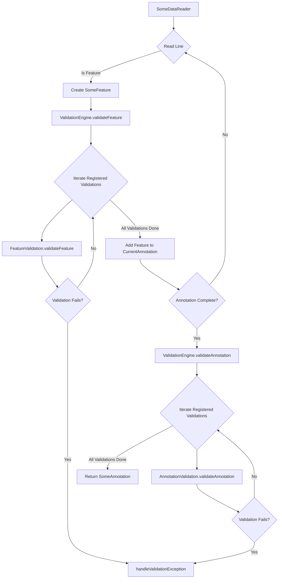

- Feature Name: Validation Engine
- Document Date: 2025-08-01
- Last Updated: 2025-08-18

# Summary

The document describes the Validation Engine for the GFF3Tools project. This engine centraises and manages the execution of various validation rules, ensuring data integrity and consistency throughout the parsing and conversion process. It is designed to be integrated with various readers and converters, allowing for both real-time syntax-level validation and aggregated semantic validation.

# Motivation & Rationale

The validation rules (`docs/0002_validation_rules.md`) provides a robust mechanism for defining rules and handling their severities. However, without a central validation engine the logic is scattered across various reader and converter classes (e.g., `GFF3FileReader`), leading to:
- **Scattered Validation Logic:** Validation checks embedded directly within parsing and processing logic, making it difficult to manage, extend, and reuse validation rules.
- **Limited Scope of Validation:** Most validations are performed on individual lines or features, with limited support for validations that require a broader context. 
- **Difficulty in State Management:** Validations that require accumulating state across multiple features (e.g., checking for duplicate IDs within an annotation, verifying parent-child relationships) are harder to implement and maintain. Implementation of such validations would pollute the parser implementation.

This Validation Engine aims to address these issues by:
- **Centralizing Validation Execution:** Providing a single entry point for all data validation, abstracting the validation logic from the parsing process.
- **Enabling Comprehensive Validation:** Supporting both syntax and semantic validations that may require accumulated state.
- **Improving Extensibility and Maintainability:** Making it easier to add new semantic validation rules and manage existing ones without modifying core reader or converter logic.

The rationale behind the chosen design emphasizes a clear separation of concerns, flexibility, and performance. By introducing a dedicated engine, we can decouple semantic validation logic from data reading, making the system more modular and testable. The design allows for both immediate syntactic and deferred semantic validation, accommodating various validation requirements efficiently.

# Usage Guidelines

The Validation Engine will be used internally by various readers/converters to ensure data quality.

**Integration with Readers/Converters:**
- Readers/converters will be modified to instantiate and use the `ValidationEngine`.
- Readers can make use of `handleSyntacticError` to report `ValidationException` errors as they happen on the stream parsing.
- The reader will call the validation engine's `validateFeature` when it parses a feature correctly so the engine can call the feature semantic validations.
- When an annotation is completed (e.g., upon encountering a delimiter or a change in sequence accession), the reader/converter will notify the `ValidationEngine` to perform any final annotation-level validations by calling `validateAnnotation`.

**Extending the Framework (Adding New Validations):**
- **Define a Validation Rule:** New validation checks will be implemented as classes that implement the `Validation` interface, typically also implementing `FeatureValidation<T>` or `AnnotationValidation<T>`.
- **Register with the Engine:** New `Validation` implementations will be registered with the `ValidationEngine` during its initialization. The engine will then manage their execution based on configured severities.

**Configuration:**
- The behavior of individual validation rules (e.g., `WARN` vs. `ERROR`) is managed by the `default-rule-severities.properties` file and CLI overrides, as described in `docs/0002_validation_rules.md`. The `ValidationEngine` makes use of these configurations to decide when to halt execution of the process.

### Code Example (Conceptual)

```java
// Conceptual Example: Integration with a Reader/Converter

public class SomeDataReader implements AutoCloseable {
    // ... existing fields ...
    private ValidationEngine<SomeFeature, SomeAnnotation> validationEngine;

    public SomeDataReader(Reader reader) {
        // ... existing initialization ...
        this.validationEngine = new ValidationEngine<>(); // Initialize the engine with appropriate generics
        // Register specific Validation implementations with the engine
        validationEngine.registerValidation(new FeatureIdValidation()); // Assuming FeatureIdValidation is generic now
        // ...
    }

    public SomeAnnotation readAnnotation() throws IOException, ValidationException {
        String line;
        while ((line = readLine()) != null) {
            // ... existing parsing logic ...
            if (lineIsMessedUp) {
                validationEngine.handleSyntacticError(new MessedUpLineException());
                continue;
            } else if (lineRepresentsAFeature) {
                SomeFeature feature = parseFeature(line); // Assuming this now returns a generic Feature
                validationEngine.validateFeature(feature); // Validate feature immediately

                // ... add feature to currentAnnotation ...

                if (annotationReadyToReturn) { // Logic for when an annotation is complete
                    validationEngine.validateAnnotation(currentAnnotation); // Perform annotation-level validations
                    return currentAnnotation; // Return the completed annotation
                }
            }
            // ...
        }
        // Handle final annotation at end of file
        if (currentAnnotation != null) {
            validationEngine.validateAnnotation(currentAnnotation);
            return currentAnnotation;
        }
        return null;
    }

    // ... other methods ...
}

// Conceptual FeatureValidation Interface
public interface FeatureValidation<T> {
    void validateFeature(T feature) throws ValidationException;
}

// Conceptual AnnotationValidation Interface
public interface AnnotationValidation<T> {
    void validateAnnotation(T annotation) throws ValidationException;
}

// Conceptual Example of a specific FeatureValidation and AnnotationValidation implementation
public class FeatureIdValidation implements FeatureValidation<GFF3Feature>, AnnotationValidation<GFF3Annotation> {
    private Set<String> featureIdsInCurrentAnnotation = new HashSet<>();

    @Override
    public String getValidationRule() {
        return "GFF3_DUPLICATE_FEATURE_ID";
    }

    @Override
    public void validateFeature(GFF3Feature feature) throws ValidationException {
        if (feature.getId().isPresent() && featureIdsInCurrentAnnotation.contains(feature.getId().get())) {
            throw new ValidationException(getValidationRule());
        }
        feature.getId().ifPresent(featureIdsInCurrentAnnotation::add);
    }

    @Override
    public void validateAnnotation(GFF3Annotation annotation) throws ValidationException {
        // No annotation-level validation needed for this specific rule, and state is not cleared here.
        // State clearing is not part of the current Validation interfaces.
    }
}
```

# System Overview / High-Level Design

The Validation Engine is designed to act as an intermediary between data readers/converters and individual semantic validation logic. It orchestrates the execution of registered validation rules, leveraging the existing `RuleSeverityState` for consistent error handling.

**Main Components:**
- **`ValidationEngine`:** The central orchestrator. It holds a collection of `Validation` instances and is responsible for iterating through them to apply validations at appropriate stages.
- **`Validation`:** A marker interface for all validation types.
- **`FeatureValidation<T>`:** Defines the contract for semantic validation logic applied to individual features of type `T`.
- **`AnnotationValidation<A>`:** Defines the contract for semantic validation logic applied to entire annotations of type `A`.
- **Concrete `Validation` Implementations:** These will be individual classes (e.g., `FeatureIdValidation`, `ParentChildValidation`) that implement `FeatureValidation<T>` or `AnnotationValidation<A>`. Each will contain the specific logic for its validation rule(s).
- **Generic Feature and Annotation Objects (`T` and `A`):** The data structures that will be passed to the validation engine and individual `Validation` implementations. (eg., `GFF3Feature` or `GFF3Annotation`)

**Diagram: Validation Engine Flow**



**High-Level Interaction:**
1.  **Initialization:** A reader/converter instantiates `ValidationEngine` with appropriate generics and registers all desired `Validation` implementations.
3.  **Syntax validation**: As the reader/converter parses each feature, if it encounters a syntax error it calls `ValidationEngine.handleSyntacticError`. The engine decides if the error should halt execution or not.
2.  **Feature Semantic Validation:** After the feature is parsed, it is passed to `ValidationEngine.validateFeature()`. The engine then iterates through all registered `Validation` instances. If a validation implements `FeatureValidation<T>`, its `validateFeature()` method is called. These individual validations can immediately throw `ValidationException` or accumulate state for later annotation-level checks.
3.  **Annotation Semantic Validation:** When a reader/converter detects the completion of an annotation (e.g., upon encountering a delimiter or a change in sequence accession), it calls `ValidationEngine.validateAnnotation()`. This triggers annotation-level semantic validations across all registered `AnnotationValidation` instances.
4.  **Error Handling:** All `ValidationException` instances generated by individual `Validation` implementations are passed to `ValidationEngine.handleValidationException()`, ensuring consistent logging, warning, or error throwing based on configured severities.

**Data Structures:**
- The `ValidationEngine` will use a `java.util.List` to store `Validation` instances. This provides a simple and ordered way to iterate through validations.
- Individual `Validation` implementations may use various data structures (e.g., `HashMap`, `HashSet`) to efficiently store and retrieve state required for their specific validation logic.

**Error Handling:**
- The `ValidationEngine` handles the severity of `ValidationException` through the `handleValidationException` method and ensures that the centralized severity configuration (`default-rule-severities.properties`, CLI overrides) is consistently applied to all exceptions.
- Any `ValidationException` re-thrown by (when severity is `ERROR`) will propagate up from the `ValidationEngine` to the calling reader/converter, potentially halting processing as per the existing error handling mechanism.

**Addressing Motivation & Rationale:**
- **Centralizing Validation Execution:** The `ValidationEngine` provides a single point of entry for validation, making readers/converters cleaner and more focused on parsing.
- **Enabling Comprehensive Validation:** The `validateFeature` and `validateAnnotation` methods, explicitly support both immediate and deferred validations, including those requiring accumulated state.
- **Improving Extensibility and Maintainability:** New validations can be added by simply creating a new `Validation` implementation and registering it with the engine, without modifying existing reader or engine code. Each validation is a self-contained unit.


# Alternatives Considered

1.  **Directly Modifying Readers/Converters for All Validations:**
    *   **Description:** Instead of a dedicated engine, continue embedding all validation logic (including complex, stateful validations) directly within the readers/converters' parsing methods.
    *   **Drawbacks:** This approach leads to highly coupled and complex reader/converter classes, violating the Single Responsibility Principle. It makes readers/converters difficult to read, maintain, and extend. Adding new validation rules requires modifying the core parsing logic, increasing the risk of introducing bugs. Stateful validations necessitates ad-hoc state management within the reader/converter, leading to potential state leakage and bugs.

2.  **Aspect-Oriented Programming (AOP) for Validation:**
    *   **Description:** Using AOP frameworks (e.g., AspectJ) to inject validation concerns into reader/converter methods.
    *   **Drawbacks:** While AOP can centralize cross-cutting concerns, it adds a significant layer of abstraction and complexity to the build process and runtime. Debugging can become more challenging as the flow of control is less explicit. For this specific use case, where validations are tightly coupled to the processing of feature and annotation objects, a more explicit object-oriented design with clear method calls is more transparent and maintainable. The current `ValidationEngine` approach achieves similar centralization without the overhead of an AOP framework.

3.  **Annotation-Based Validation (as discussed in `0002_validation_rules.md`):**
    *   **Description:** Applying annotations to feature or annotation data objects/fields/methods, with a framework processing these annotations.
    *   **Drawbacks:** As previously noted in `docs/0002_validation_rules.md`, this is less suitable for stream-based processing and validations that depend on the context of multiple records or file structure. It's more geared towards validating self-contained data objects rather than a sequential stream of data. Implementing a custom annotation processor for specific needs would introduce unnecessary complexity.

# Technical Debt / Future Considerations

**Known Limitations / Technical Debt:**
-   **Order of Validations:** The current design implies that the order in which `Validation` instances are registered with the `ValidationEngine` dictates their execution order. While this is generally acceptable, for validations with interdependencies, explicit ordering might be required in the future or a dependency management system for validations could be considered.
-   **Performance Overhead:** For extremely large files, iterating through a potentially long list of `Validation` instances for every feature might introduce a performance overhead. This would need to be monitored and optimized if it becomes a bottleneck.

**Potential Future Extensions / Improvements:**
- **Asynchronous Validation:** For very long-running or resource-intensive validations, consider an asynchronous execution model to prevent blocking the main parsing thread.
-   **Plugin System for Validations:** Develop a more formal plugin system that allows users to easily add their custom `Validation` implementations without modifying the core application code.

**Related Issues / Out of Scope:**
-   **Cross-File Validation:** Validations that require comparing data across multiple files are outside the scope of this engine, which focuses on single-file/single-annotation/multi-annotation validation.
-   **Complex Semantic Validation Beyond Basic Structure:** While the engine supports structural and basic content validation, highly complex semantic validations that require deep biological knowledge or external database lookups are beyond the scope of the core engine and would be implemented as specialized `Validation` instances, potentially interacting with other services.

# Related Documentation & Resources

-   **Existing Validation Rules Document:** `docs/0002_validation_rules.md` (describes the foundational `ValidationRule`).
-   **Relevant Code Directories (Proposed):**
    -   `src/main/java/uk/ac/ebi/embl/converter/validation/`: Will contain `ValidationEngine.java` and `GFF3Validation.java`.
    -   `src/main/java/uk/ac/ebi/embl/converter/validation/impl/`: New package for concrete `GFF3Validation` implementations.
-   **External Libraries:**
    -   SLF4j: For logging.
-   **GFF3 Specifications:**
    -   [GFF3 INSDC Specification](https://docs.google.com/document/d/1HrF-H3K_e9uOcgBzTpi53FZerplPXmyC/edit?pli=1&tab=t.0)
    -   [GFF3 Lincoln Stein Specification](https://github.com/The-Sequence-Ontology/Specifications/blob/master/gff3.md)


