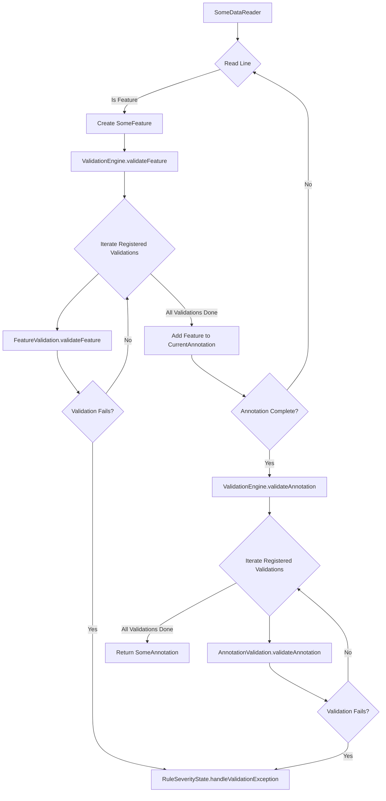

- Feature Name: Validation Engine
- Document Date: 2025-08-01
- Last Updated: 2025-08-01

# Summary

This document proposes a new Validation Engine for the GFF3Tools project. This engine will centralize and manage the execution of various validation rules on biological data, ensuring data integrity and consistency throughout the parsing and conversion process. It is designed to be integrated with various readers and converters, allowing for both real-time feature-level validation and aggregated annotation-level validation.

# Motivation & Rationale

The existing validation framework (`docs/0002_validation_rules.md`) provides a robust mechanism for defining rules and handling their severities. However, the current implementation of validation logic is scattered across various reader and converter classes (e.g., `GFF3FileReader`), leading to:
- **Scattered Validation Logic:** Validation checks are currently embedded directly within parsing and processing logic, making it difficult to manage, extend, and reuse validation rules.
- **Limited Scope of Validation:** Most validations are performed on individual lines or features, with limited support for validations that require a broader context (e.g., an entire GFF3 annotation or even the whole file).
- **Difficulty in State Management:** Validations that require accumulating state across multiple features (e.g., checking for duplicate IDs within an annotation, verifying parent-child relationships) are harder to implement and maintain.

This Validation Engine aims to address these issues by:
- **Centralizing Validation Execution:** Providing a single entry point for all data validation, abstracting the validation logic from the parsing process.
- **Enabling Comprehensive Validation:** Supporting both immediate, feature-level validations and deferred, annotation-level validations that require accumulated state.
- **Improving Extensibility and Maintainability:** Making it easier to add new validation rules and manage existing ones without modifying core reader or converter logic.

The rationale behind the chosen design emphasizes a clear separation of concerns, flexibility, and performance. By introducing a dedicated engine, we can decouple validation logic from data reading, making the system more modular and testable. The design allows for both immediate and deferred validation, accommodating various validation requirements efficiently.

# Usage Guidelines

The Validation Engine will primarily be used internally by various readers/converters to ensure data quality.

**Integration with Readers/Converters:**
- Readers/converters will be modified to instantiate and use the `ValidationEngine`.
- For each feature read, the reader/converter will pass the feature to the `ValidationEngine` for processing.
- When an annotation is completed (e.g., upon encountering a delimiter or a change in sequence accession), the reader/converter will notify the `ValidationEngine` to perform any final annotation-level validations.

**Extending the Framework (Adding New Validations):**
- **Define a Validation Rule:** New validation checks will be implemented as classes that implement the `Validation` interface, typically also implementing `FeatureValidation<T>` or `AnnotationValidation<T>`.
- **Register with the Engine:** New `Validation` implementations will be registered with the `ValidationEngine` during its initialization. The engine will then manage their execution based on configured severities.
- **Leverage Existing `ValidationRule` and `RuleSeverityState`:** Each specific validation will utilize the existing `ValidationRule` enum for identification and `RuleSeverityState.handleValidationException()` for consistent error/warning handling.

**Configuration:**
- The behavior of individual validation rules (e.g., `WARN` vs. `ERROR`) will continue to be managed by the `default-rule-severities.properties` file and CLI overrides, as described in `docs/0002_validation_rules.md`. The `ValidationEngine` will respect these configurations.

### Code Example (Conceptual)

```java
// Conceptual Example: Integration with a Reader/Converter

public class SomeDataReader implements AutoCloseable {
    // ... existing fields ...
    private ValidationEngine<SomeFeature, SomeAnnotation> validationEngine;

    public SomeDataReader(Reader reader) {
        // ... existing initialization ...
        this.validationEngine = new ValidationEngine<>(); // Initialize the engine with appropriate generics
        // Register specific Validation implementations with the engine
        validationEngine.registerValidation(new FeatureIdValidation()); // Assuming FeatureIdValidation is generic now
        // ...
    }

    public SomeAnnotation readAnnotation() throws IOException, ValidationException {
        String line;
        while ((line = readLine()) != null) {
            // ... existing parsing logic ...
            if (lineRepresentsAFeature) {
                SomeFeature feature = parseFeature(line); // Assuming this now returns a generic Feature
                validationEngine.validateFeature(feature); // Validate feature immediately

                // ... add feature to currentAnnotation ...

                if (annotationReadyToReturn) { // Logic for when an annotation is complete
                    validationEngine.validateAnnotation(currentAnnotation); // Perform annotation-level validations
                    return currentAnnotation; // Return the completed annotation
                }
            }
            // ...
        }
        // Handle final annotation at end of file
        if (currentAnnotation != null) {
            validationEngine.validateAnnotation(currentAnnotation);
            return currentAnnotation;
        }
        return null;
    }

    // ... other methods ...
}

// Conceptual FeatureValidation Interface
public interface FeatureValidation<T> {
    void validateFeature(T feature) throws ValidationException;
}

// Conceptual AnnotationValidation Interface
public interface AnnotationValidation<T> {
    void validateAnnotation(T annotation) throws ValidationException;
}

// Conceptual Example of a specific FeatureValidation and AnnotationValidation implementation
public class FeatureIdValidation implements FeatureValidation<GFF3Feature>, AnnotationValidation<GFF3Annotation> {
    private Set<String> featureIdsInCurrentAnnotation = new HashSet<>();

    @Override
    public ValidationRule getAssociatedRule() {
        return ValidationRule.GFF3_DUPLICATE_FEATURE_ID
    }

    @Override
    public void validateFeature(GFF3Feature feature) throws ValidationException {
        if (feature.getId().isPresent() && featureIdsInCurrentAnnotation.contains(feature.getId().get())) {
            throw new ValidationException(ValidationRule.GFF3_DUPLICATE_FEATURE_ID);
        }
        feature.getId().ifPresent(featureIdsInCurrentAnnotation::add);
    }

    @Override
    public void validateAnnotation(GFF3Annotation annotation) throws ValidationException {
        // No annotation-level validation needed for this specific rule, and state is not cleared here.
        // State clearing is not part of the current Validation interfaces.
    }
}
```

# System Overview / High-Level Design

The Validation Engine is designed to act as an intermediary between data readers/converters and individual validation logic. It orchestrates the execution of registered validation rules, leveraging the existing `RuleSeverityState` for consistent error handling.

**Main Components:**
- **`ValidationEngine` (Existing Class):** The central orchestrator. It holds a collection of `Validation` instances and is responsible for iterating through them to apply validations at appropriate stages.
- **`Validation` (Existing Interface):** A marker interface for all validation types.
- **`FeatureValidation<T>` (New Interface):** Defines the contract for validation logic applied to individual features of type `T`.
- **`AnnotationValidation<A>` (New Interface):** Defines the contract for validation logic applied to entire annotations of type `A`.
- **Concrete `Validation` Implementations (Existing Classes):** These will be individual classes (e.g., `FeatureIdValidation`, `ParentChildValidation`) that implement `FeatureValidation<T>` or `AnnotationValidation<A>`. Each will contain the specific logic for its validation rule(s).
- **Generic Feature and Annotation Objects (`T` and `A`):** The data structures that will be passed to the validation engine and individual `Validation` implementations.

**Diagram: Validation Engine Flow**



**High-Level Interaction:**
1.  **Initialization:** A reader/converter instantiates `ValidationEngine` with appropriate generics and registers all desired `Validation` implementations.
2.  **Feature Validation:** As a reader/converter parses each feature, it passes the feature to `ValidationEngine.validateFeature()`. The engine then iterates through all registered `Validation` instances. If a validation implements `FeatureValidation<T>`, its `validateFeature()` method is called. These individual validations can immediately throw `ValidationException` (which `RuleSeverityState` will handle) or accumulate state for later annotation-level checks.
3.  **Annotation Completion Notification:** When a reader/converter detects the completion of an annotation (e.g., upon encountering a delimiter or a change in sequence accession), it calls `ValidationEngine.validateAnnotation()`. This triggers annotation-level validations across all registered `AnnotationValidation` instances.
4.  **Error Handling:** All `ValidationException` instances generated by individual `Validation` implementations are passed to `RuleSeverityState.handleValidationException()`, ensuring consistent logging, warning, or error throwing based on configured severities.

**Integration with Existing System:**
The `ValidationEngine` will become the central point of contact for validation within various readers/converters. This decouples the reader/converter's responsibility of parsing from the responsibility of validating, making both components cleaner and more focused. It leverages the existing `ValidationRule` and `RuleSeverityState` enums and classes, ensuring continuity with the established error handling framework.

# Detailed Design & Implementation

The core of the Validation Engine will revolve around the `ValidationEngine` class and the `Validation` interfaces.

**Key Classes and Interfaces:**

1.  **`uk.ac.ebi.embl.converter.validation.ValidationEngine.java` (Existing Class):**
    *   **Purpose:** Orchestrates the execution of multiple `Validation` instances, specifically `FeatureValidation` and `AnnotationValidation`. It acts as the public API for triggering validations from readers/converters.
    *   **Fields:**
        *   `private final List<Validation> validations;`: A list to hold all registered `Validation` implementations. This allows for easy iteration and extension.
    *   **Constructor:**
        *   `public ValidationEngine()`: Initializes the `validations` list.
    *   **Methods:**
        *   `public void registerValidation(Validation validation)`: Adds a `Validation` instance to the list of validations to be executed. This allows for modular registration of specific validation rules.
        *   `public void validateFeature(T feature)`: Iterates through all registered `Validation` instances. If a validation implements `FeatureValidation<T>`, its `validateFeature(feature)` method is called. This method will catch any `ValidationException` thrown by individual validations and re-throw them if their severity is `ERROR`.
        *   `public void validateAnnotation(A annotation)`: Similar to `validateFeature`, but calls `validateAnnotation(annotation)` on registered `AnnotationValidation<A>` instances. Validations do not explicitly clear state through the engine.

2.  **`uk.ac.ebi.embl.converter.validation.Validation.java` (Existing Interface):**
    *   **Purpose:** A marker interface for all validation types.

3.  **`uk.ac.ebi.embl.converter.validation.FeatureValidation.java` (New Interface):**
    *   **Purpose:** Defines the contract for any class that provides feature-specific validation logic. This promotes a standardized approach to creating new feature validations.
    *   **Methods:**
        *   `void validateFeature(T feature) throws ValidationException;`: Implementations will contain logic to validate an individual `T` (e.g., `GFF3Feature`, `EmblFeature`). This method should throw a `ValidationException` if a rule is violated, which will then be handled by `RuleSeverityState`.

4.  **`uk.ac.ebi.embl.converter.validation.AnnotationValidation.java` (New Interface):**
    *   **Purpose:** Defines the contract for any class that provides annotation-specific validation logic. This promotes a standardized approach to creating new annotation validations.
    *   **Methods:**
        *   `void validateAnnotation(T annotation) throws ValidationException;`: Implementations will contain logic to validate an entire `T` (e.g., `GFF3Annotation`, `EmblEntry`). This is where validations requiring a complete annotation context will be performed.

5.  **Concrete `Validation` Implementations (e.g., `uk.ac.ebi.embl.converter.validation.impl.FeatureIdValidation.java`):**
    *   **Purpose:** Each class will encapsulate the logic for one or more closely related validation rules.
    *   **Implementation Details:**
        *   Will implement `FeatureValidation<T>` or `AnnotationValidation<A>`.
        *   Will use `RuleSeverityState.getSeverity(ValidationRule.YOUR_RULE)`.
        *   Will use `RuleSeverityState.handleValidationException(new ValidationException(ValidationRule.YOUR_RULE))` when a validation fails.
        *   May maintain internal data structures (e.g., `Set<String>`) to accumulate information across features within an annotation for deferred validation.

**Data Structures:**
- The `ValidationEngine` will use a `java.util.List` to store `Validation` instances. This provides a simple and ordered way to iterate through validations.
- Individual `Validation` implementations may use various data structures (e.g., `HashMap`, `HashSet`) to efficiently store and retrieve state required for their specific validation logic.

**Error Handling:**
- The `ValidationEngine` itself will not directly handle the severity of `ValidationException`. Instead, it will rely on the existing `RuleSeverityState.handleValidationException()` method within each `Validation` implementation. This ensures that the centralized severity configuration (`default-rule-severities.properties`, CLI overrides) is consistently applied.
- Any `ValidationException` re-thrown by `RuleSeverityState.handleValidationException()` (when severity is `ERROR`) will propagate up from the `ValidationEngine` to the calling reader/converter, potentially halting processing as per the existing error handling mechanism.

**Addressing Motivation & Rationale:**
- **Centralizing Validation Execution:** The `ValidationEngine` provides a single point of entry for validation, making readers/converters cleaner and more focused on parsing.
- **Enabling Comprehensive Validation:** The `validateFeature` and `validateAnnotation` methods, explicitly support both immediate and deferred validations, including those requiring accumulated state.
- **Improving Extensibility and Maintainability:** New validations can be added by simply creating a new `Validation` implementation and registering it with the engine, without modifying existing reader or engine code. Each validation is a self-contained unit.


# Alternatives Considered

1.  **Directly Modifying Readers/Converters for All Validations:**
    *   **Description:** Instead of a dedicated engine, continue embedding all validation logic (including complex, stateful validations) directly within the readers/converters' parsing methods.
    *   **Drawbacks:** This approach leads to highly coupled and complex reader/converter classes, violating the Single Responsibility Principle. It makes readers/converters difficult to read, maintain, and extend. Adding new validation rules requires modifying the core parsing logic, increasing the risk of introducing bugs. Stateful validations necessitates ad-hoc state management within the reader/converter, leading to potential state leakage and bugs.

2.  **Aspect-Oriented Programming (AOP) for Validation:**
    *   **Description:** Using AOP frameworks (e.g., AspectJ) to inject validation concerns into reader/converter methods.
    *   **Drawbacks:** While AOP can centralize cross-cutting concerns, it adds a significant layer of abstraction and complexity to the build process and runtime. Debugging can become more challenging as the flow of control is less explicit. For this specific use case, where validations are tightly coupled to the processing of feature and annotation objects, a more explicit object-oriented design with clear method calls is more transparent and maintainable. The current `ValidationEngine` approach achieves similar centralization without the overhead of an AOP framework.

3.  **Annotation-Based Validation (as discussed in `0002_validation_rules.md`):**
    *   **Description:** Applying annotations to feature or annotation data objects/fields/methods, with a framework processing these annotations.
    *   **Drawbacks:** As previously noted in `docs/0002_validation_rules.md`, this is less suitable for stream-based processing and validations that depend on the context of multiple records or file structure. It's more geared towards validating self-contained data objects rather than a sequential stream of data. Implementing a custom annotation processor for specific needs would introduce unnecessary complexity.

# Technical Debt / Future Considerations

**Known Limitations / Technical Debt:**
-   **Order of Validations:** The current design implies that the order in which `Validation` instances are registered with the `ValidationEngine` dictates their execution order. While this is generally acceptable, for validations with interdependencies, explicit ordering might be required in the future or a dependency management system for validations could be considered.
-   **Performance Overhead:** For extremely large files, iterating through a potentially long list of `Validation` instances for every feature might introduce a performance overhead. This would need to be monitored and optimized if it becomes a bottleneck (e.g., by pre-filtering validations based on `RuleSeverityState`).

**Potential Future Extensions / Improvements:**
- **Asynchronous Validation:** For very long-running or resource-intensive validations, consider an asynchronous execution model to prevent blocking the main parsing thread.
-   **Plugin System for Validations:** Develop a more formal plugin system that allows users to easily add their custom `Validation` implementations without modifying the core application code.

**Related Issues / Out of Scope:**
-   **Cross-File Validation:** Validations that require comparing data across multiple files are outside the scope of this engine, which focuses on single-file/single-annotation/multi-annotation validation.
-   **Complex Semantic Validation Beyond Basic Structure:** While the engine supports structural and basic content validation, highly complex semantic validations that require deep biological knowledge or external database lookups are beyond the scope of the core engine and would be implemented as specialized `Validation` instances, potentially interacting with other services.

# Testing Strategy

The Validation Engine and its `GFF3Validation` implementations will be thoroughly tested at multiple levels:

-   **Unit Tests:**
    -   **`ValidationEngineTest`:** Tests for `ValidationEngine` will ensure that:
        -   `GFF3Validation` instances are correctly registered.
        -   `validateFeature()` and `validateAnnotation()` methods correctly iterate and invoke registered validations.
        -   `clearAnnotationState()` correctly invokes `clearState()` on all registered validations.
        -   Exceptions thrown by individual validations are propagated correctly (or handled as warnings/ignored based on `RuleSeverityState`).
    -   **`GFF3Validation` Implementation Tests:** Each concrete `GFF3Validation` class (e.g., `FeatureIdValidationTest`) will have dedicated unit tests to verify its specific validation logic for various valid and invalid inputs. These tests will mock `RuleSeverityState` to assert that `handleValidationException()` is called with the expected `ValidationRule` and `ValidationException`.

-   **Integration Tests:**
    -   Tests will be written to verify the integration of `ValidationEngine` with `GFF3FileReader`. These tests will involve reading sample GFF3 files with known validation issues and asserting that the `ValidationEngine` correctly identifies and handles these issues based on the configured `RuleSeverityState`. This will ensure that the entire flow, from parsing to validation, works as expected.
    -   Tests will also verify that stateful validations correctly clear their state between annotations.

-   **Test Data:**
    -   A comprehensive set of sample GFF3 files will be created, including:
        -   Valid GFF3 files.
        -   Files with single-feature validation errors (e.g., missing ID, invalid coordinate).
        -   Files with annotation-level validation errors (e.g., duplicate IDs within an annotation, incorrect parent-child relationships).
        -   Files demonstrating `WARN` and `OFF` severity rules to ensure correct non-halting behavior.

-   **Frameworks:**
    -   JUnit 5 for test execution.
    -   Mockito for mocking dependencies (e.g., `RuleSeverityState` if direct interaction is not desired in some unit tests, though direct interaction is often beneficial for integration tests).

**Verification:**
Developers can verify the correct functioning of the feature by:
-   Running the provided unit and integration tests.
-   Using the GFF3Tools CLI with the `--rules` option to experiment with different severity configurations for validation rules and observe the output (errors, warnings, or ignored).

# Deployment & Operations

**Deployment:**
The Validation Engine is an integral part of the `gff3tools` library. It will be deployed as part of the standard `gff3tools` JAR package. No special deployment steps are required beyond the existing deployment process for the `gff3tools` application.

**Operational Considerations:**
-   **Logging:** `ValidationException` instances that result in warnings (`RuleSeverity.WARN`) will be logged using SLF4j, as per the existing `RuleSeverityState` implementation. This ensures that non-critical validation issues are recorded for review. `ERROR` level exceptions will halt execution, providing immediate feedback.
-   **Configuration Management:** The `default-rule-severities.properties` file will be packaged within the application resources. Users can override these defaults via command-line arguments, providing flexibility without requiring application redeployment.

**Dependencies:**
-   The Validation Engine will depend on existing `gff3tools` modules, including `uk.ac.ebi.embl.converter.exception`, `uk.ac.ebi.embl.converter.gff3`, and `uk.ac.ebi.embl.converter.validation`.
-   It will continue to use SLF4j for logging, consistent with the rest of the application.
-   No new external dependencies are introduced by this design.

# Related Documentation & Resources

-   **Existing Validation Rules Document:** `docs/0002_validation_rules.md` (describes the foundational `ValidationRule` and `RuleSeverityState` components).
-   **Relevant Code Directories (Proposed):**
    -   `src/main/java/uk/ac/ebi/embl/converter/validation/`: Will contain `ValidationEngine.java` and `GFF3Validation.java`.
    -   `src/main/java/uk/ac/ebi/embl/converter/validation/impl/`: New package for concrete `GFF3Validation` implementations.
-   **External Libraries:**
    -   SLF4j: For logging.
-   **GFF3 Specifications:**
    -   [GFF3 INSDC Specification](https://docs.google.com/document/d/1HrF-H3K_e9uOcgBzTpi53FZerplPXmyC/edit?pli=1&tab=t.0)
    -   [GFF3 Lincoln Stein Specification](https://github.com/The-Sequence-Ontology/Specifications/blob/master/gff3.md)


