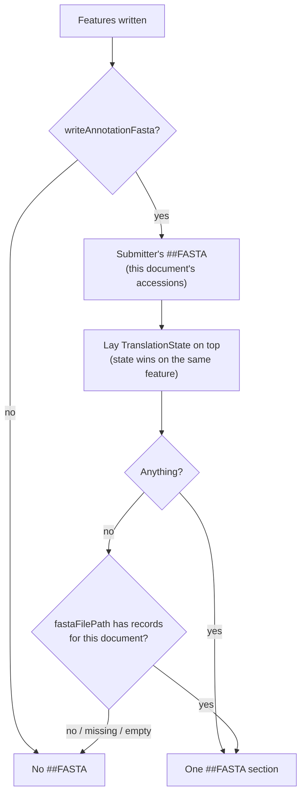

- Feature Name: `annotation_scoped_fasta_writing`
- Document Date: 2026-09-07
- Last Updated: 2026-09-14

# Summary

A written GFF3 document has **one** `##FASTA` section, after its last annotation. It holds the
translations of **that document's annotations only**.

Translations come from three places:

1. **The source GFF3's own `##FASTA`**: what the submitter sent (read via `gff3Reader`).
2. **`translationState`**: what validation captured or computed (`TranslationFix`).
3. **`fastaFilePath`**: a translation FASTA the caller supplied.

Sources 1 and 2 are **merged feature by feature**, and 2 wins when both have the same feature.
Source 3 is a backup, used only when that merge has nothing at all.

# Motivation & Rationale

**A `##FASTA` per annotation was invalid GFF3.** `##FASTA` ends the feature section, so every
annotation after the first one was lost when the file was read back, without any error.

**The fallback never fell back.** `TranslationState` always exists (an auto-discovered provider), so
"use the first source that isn't null" always picked it. When it was empty, the other sources were
never tried.

**Picking one source lost translations.** One CDS with an inline `translation=` puts an entry in
`TranslationState`. With "first source wins", every *other* CDS then lost the translation it had
in the submitter's `##FASTA`.

**Documents got translations that weren't theirs.** Sources handed over everything they held, and
accessions were matched by prefix, so `AB123.1` claimed `AB123.10`'s translations.

# Usage Guidelines

```java
GFF3File.builder()
        .header(header)
        .species(species)
        .annotations(annotations)
        .gff3Reader(reader)                  // any of the three sources, all optional
        .translationState(translationState)
        .fastaFilePath(fallbackFasta)
        .writeAnnotationFasta(true)          // defaults to false = no ##FASTA at all
        .build()
        .writeGFF3String(writer);
```

- **`writeAnnotationFasta`** means "write translations". `false` gives a features-only document
  even when sources are set. `GFF3FileFactory.from`, `ValidationCommand`, `TranslationCommand` and
  the TSV converter pass `true`. `fromAnnotationAndReader` passes on whatever the caller chose.

**How the fallback works:**

- **Merge first.** Take the submitter's translations for this document, then lay
  `TranslationState` on top. Where both have a feature, the state wins. Where only one has it,
  keep it.
- **Backup only if the merge is empty.** Then copy this document's records from `fastaFilePath`.
  A missing, empty or unrelated file is logged and gives nothing; the write doesn't fail.
- **Nothing anywhere means no `##FASTA` line.** An empty section is never written.
- **The backup is all-or-nothing per document.** If even one feature got a translation from the
  merge, `fastaFilePath` isn't read at all.

**Scoping.** Every source is filtered to the document's accessions, so a subset of a submission
carries exactly that subset's translations. In `fastaFilePath`, a record is kept by the accession
in its `>accession|featureId` header. Any other header shape is dropped and logged.

**Matching is exact**, version included. An accession without a version matches nothing. A missing
translation is easy to spot, a misattributed one isn't.

# System Overview / High-Level Design

```
##gff-version …        header, when set
##species …            when set
…features…             every annotation, in order
##FASTA                once, only if there are translations
>accession|featureId   only this document's accessions
```



- `TranslationState` (`validation/provider`) is where `TranslationFix` records translations.
- `GFF3TranslationReader`, behind `GFF3FileReader`, indexes the source's `##FASTA` by byte offset
  and reads proteins on demand.
- `TranslationKey` owns the `accession|featureId` format.

# Detailed Design & Implementation

**`writeTranslationSection`** runs once, after all features:

1. Collect the document's accessions.
2. Fill a `LinkedHashMap` with the reader's translations for each annotation, in annotation order.
3. Put in the `TranslationState` entries for those accessions. Same key: replaced. New key:
   added at the end.
4. If the map has anything, write it and stop.
5. Otherwise copy matching records from `fastaFilePath`. `##FASTA` is written only when the first
   matching record turns up, so a file with nothing relevant leaves no bare directive.

**Key questions live in `TranslationKey`**:

```java
public static String accessionOf(String key);                          // text before the first '|'
public static boolean belongsToAny(String key, Set<String> accessions); // exact match
```

Splitting on the first `|` is safe: accessions never contain one, and feature IDs are URL-encoded
(`|` becomes `%7C`). The prefix bug came from two places answering this question differently.

**Offset lookup.** `GFF3FileReader` groups its offsets by accession once and reuses them, so one
parse can write many documents. The groups keep sorted order, so output is byte-stable.

**Why does the state win?** It's what validation produced or captured, so it's the newer answer.

**Why is `fastaFilePath` last?** It's a caller-supplied extra. The submitter's own data and
validation's results come first.

# Alternatives Considered

- **Several documents in one file**, one after another. Rejected: a repeated `##gff-version`
  mid-file isn't valid GFF3 either, and our reader still stops at the first `##FASTA`.
- **Keep per-annotation `##FASTA`**, documented as multi-document output. Rejected: it keeps a
  way to write invalid files, and one document per annotation already covers the use case.
- **Pick one source, don't merge.** Rejected: it drops translations for features validation never
  touched (see Motivation).

# Technical Debt / Future Considerations

- **The backup is per document, not per feature.** A feature missing from the merge isn't looked
  up in `fastaFilePath` if any other feature was found. Fix if needed: put the file's records into
  the map before the state.
- **No reverse check** that every CDS in the document has a translation.
- **`GFF3FileFactory.from` takes `##species` from the first entry only**, dropping later organisms
  without a warning.
- **Not streaming.** One trailing section needs all annotations up front. `2604071325` lists this as
  future work.

# Testing Strategy

- **`Gff3FileWritingTest`** checks the output is valid GFF3, round-trips, and has `##FASTA` matching
  its own annotations. It covers both factory methods, the backup file (missing, empty, unrelated)
  and exact accession matching.
- **`Gff3FileRegroupingTest`** covers splitting one document into several.
- **`ValidationCommandTest.validation_mergesTranslationStateWithRawFastaPassthrough_perFeature`**
  pins the merge: state wins on the same feature, and submitter-only features keep their
  translation.
- Two tests only record current behaviour rather than a requirement: the stamped spec version, and
  `##species` from the first entry.

Run with `./gradlew test`.

# Related Documentation & Resources

- `docs/2604071325_move_translation_fasta_writing.md`: made `TranslationState` the translation
  source of truth and moved `##FASTA` to the end of the document.
- `docs/2603171142_allow_loading_sequence_translations.md`: the `translate` command and the
  sequence sources behind `TranslationFix`.
- Key code: `gff3/GFF3File.java`, `gff3/TranslationKey.java`, `fftogff3/GFF3FileFactory.java`,
  `gff3/reader/GFF3FileReader.java`, `gff3/reader/GFF3TranslationReader.java`,
  `validation/provider/TranslationState.java`, `validation/fix/TranslationFix.java`
