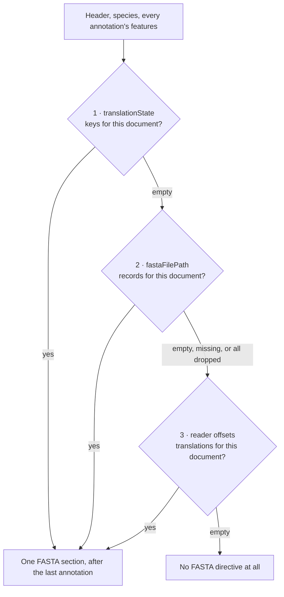

- Feature Name: `annotation_scoped_fasta_writing`
- Document Date: 2026-09-07
- Last Updated: 2026-09-14

# Summary

A written GFF3 document carries its translations in one `##FASTA` section after the last
annotation, and that section holds the translations of the annotations in that document and no
others.

The translations come from the first of three sources that actually has something to give:

1. `translationState` — translations generated by `TranslationFix` during validation, or captured
   from a flat file's `/translation` qualifier.
2. `fastaFilePath` — a translation FASTA the caller supplied.
3. `gff3Reader` offsets — translations read back out of a source GFF3's own `##FASTA`.

This replaces a writer that could put a `##FASTA` section after every annotation, and that chose
its source by asking whether a source object existed rather than whether it held anything.

# Motivation & Rationale

**A `##FASTA` section per annotation produced invalid GFF3.** `##FASTA` ends the feature section:
everything after it is sequence data. A document with several annotations therefore had feature
lines after its first `##FASTA`, and our own reader stops there, so it read such a document back as
a single annotation without complaining.

**The fallback chain never reached its fallbacks.** `TranslationState` comes from an
auto-discovered provider, so it is never null. Picking the first non-null source always picked it,
and when it was empty the section was skipped and the other two sources were never tried.

**Documents received translations that were not theirs**, because a source handed over everything
it held, and **accessions were matched by string prefix**, so `AB123.1` claimed everything
belonging to `AB123.10`.

The fix: one valid place for the section, so the writer no longer offers a choice about where it
goes; sources chosen by what they hold, so the fallback order means something; and translations
filtered to the document's own annotations, so its FASTA section describes its feature section
whether it holds one annotation or all of them.

# Usage Guidelines

Supply a source and opt in:

```java
GFF3File.builder()
        .header(header)
        .species(species)
        .annotations(annotations)
        .translationState(translationState)   // or .fastaFilePath(...) / .gff3Reader(...)
        .writeAnnotationFasta(true)           // defaults to false
        .build()
        .writeGFF3String(writer);
```

`writeAnnotationFasta` defaults to `false`, so supplying a source without the flag gives a
features-only document. `GFF3FileFactory.from` always sets it; `fromAnnotationAndReader` takes the
caller's choice, and the flag is the only way to ask it for a features-only document, because it
always passes a `TranslationState` from the reader's context.

**How the fallback works.** Each source reports whether it wrote anything, and an empty one hands
over to the next — so an empty `TranslationState` lets the supplied FASTA file, and then the
reader's own translations, have a turn. A `fastaFilePath` that is missing, empty, or not a regular
file counts as empty too: it is logged and the chain continues, rather than failing a write that
has already put its feature lines in the output. If no source has anything, no `##FASTA` directive
is written — an empty section is never emitted.

**Scoping.** A document carries the translations of the annotations it holds; give it a subset of a
submission and it carries exactly that subset's translations. This includes `fastaFilePath`, whose
records are kept or dropped by the accession in their `>accession|featureId` header — a header in
any other shape is dropped and logged.

**Accession matching is exact**, version suffix included. An annotation recorded without its
version matches no translations rather than every version of that accession: a missing translation
is a visible failure, a misattributed one is not.

# System Overview / High-Level Design

`GFF3File.writeGFF3String` emits:

```
##gff-version …        header, when set
##species …            when set
…features…             every annotation, in order
##FASTA                once, only when a source has translations
>accession|featureId   scoped to this document's annotations
```

The source chain behind that one section:



`TranslationState` (`validation/provider`) is the shared state `TranslationFix` records into during
validation. `GFF3TranslationReader`, behind `GFF3FileReader`, indexes a source GFF3's `##FASTA` by
byte offset, so proteins are read one at a time instead of being held in memory. `TranslationKey`
owns the `accession|featureId` format and the questions you can ask about a key.

# Detailed Design & Implementation

**Writing the section.** `writeGFF3String` writes every annotation's features, then runs the source
chain once. Each source writer returns whether it emitted anything, so the `##FASTA` directive is
only ever written by a source that has something to put under it. The verbatim-copy source writes
the directive after its first chunk of content, so an unreadable file leaves no bare directive
behind.

**Scoping.** The document's accessions are collected once per write, and the two filterable sources
are reduced to the keys that belong to them. `TranslationKey` decides:

```java
public static String accessionOf(String key);                          // before the first '|'
public static boolean belongsToAny(String key, Set<String> accessions); // exact match
```

Splitting on the first separator is safe: an accession never contains `|`, and feature IDs are
URL-encoded by `TranslationKey.of` (`|` → `%7C`). Both questions live in that one class on purpose —
the prefix defect existed because two places answered the same question separately.

**Offset lookup.** `GFF3FileReader` buckets its offset map by accession on first use and keeps it
for the reader's life, so one reader can write many documents from a single parse, and the buckets
keep the map's sorted order so output is byte-stable.

**Why keep `writeAnnotationFasta`?** `fromAnnotationAndReader` always supplies a `TranslationState`,
so the flag is the only way to ask it for a features-only document; it is also public API used
outside this repository. **Why is the offset source last?** It holds a submitter's own `##FASTA`
rather than anything gff3tools produced, so a populated `TranslationState` wins where the two
disagree.

# Alternatives Considered

**A concatenated multi-document format** — every annotation written as a standalone document, one
after another in the same file. Rejected: a repeated `##gff-version` mid-file is not valid GFF3
either, and our own reader would still stop at the first `##FASTA`. Everything we need is
expressible as an ordinary valid document.

**Keeping the per-annotation mode**, documented as multi-document output. Rejected: it keeps a way
to produce invalid output for a use case that one document per annotation already serves.

# Technical Debt / Future Considerations

- **Nothing checks the reverse direction**: that every translation belongs to an annotation in the
  document.
- **A submitted `##FASTA` is used or ignored silently**, depending on whether a higher-priority
  source has anything.
- **`GFF3FileFactory.from` takes `##species` from the first entry only**, discarding later organisms
  without a diagnostic.
- **Streaming.** A single trailing section needs the annotation set up front; a streaming writer
  would need two passes or a temporary file. `2604071325` lists this as future work.

# Testing Strategy

`Gff3FileWritingTest` groups its tests by the properties a document must satisfy: it is valid GFF3,
it round-trips, and its `##FASTA` matches its own annotations. It covers both factory methods, the
fallback chain including missing and empty sources, and exact accession matching.
`Gff3FileRegroupingTest` covers splitting one document into several, where scoping earns its keep.
Two tests are labelled characterisations rather than requirements: the stamped specification
version, and `##species` taken from the first entry only.

Run with `./gradlew test`.

# Related Documentation & Resources

- `docs/2604071325_move_translation_fasta_writing.md` — made `TranslationState` the translation
  source of truth and moved the FASTA section to the end of the document.
- `docs/2603171142_allow_loading_sequence_translations.md` — the `translate` command and the
  sequence-source chain that feeds `TranslationFix`.
- Key code: `gff3/GFF3File.java`, `gff3/TranslationKey.java`, `fftogff3/GFF3FileFactory.java`,
  `gff3/reader/GFF3FileReader.java`, `gff3/reader/GFF3TranslationReader.java`,
  `validation/provider/TranslationState.java`, `validation/fix/TranslationFix.java`
